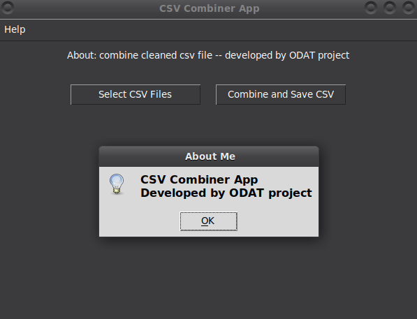

# Tool 2

This GUI application lets you select multiple CSV files, automatically merge only their common columns into one combined dataset, and save the result as a new CSV via a simple, resizable interface.

## Description

[Visit odat.info](https://odat.info)

## Screenshot

